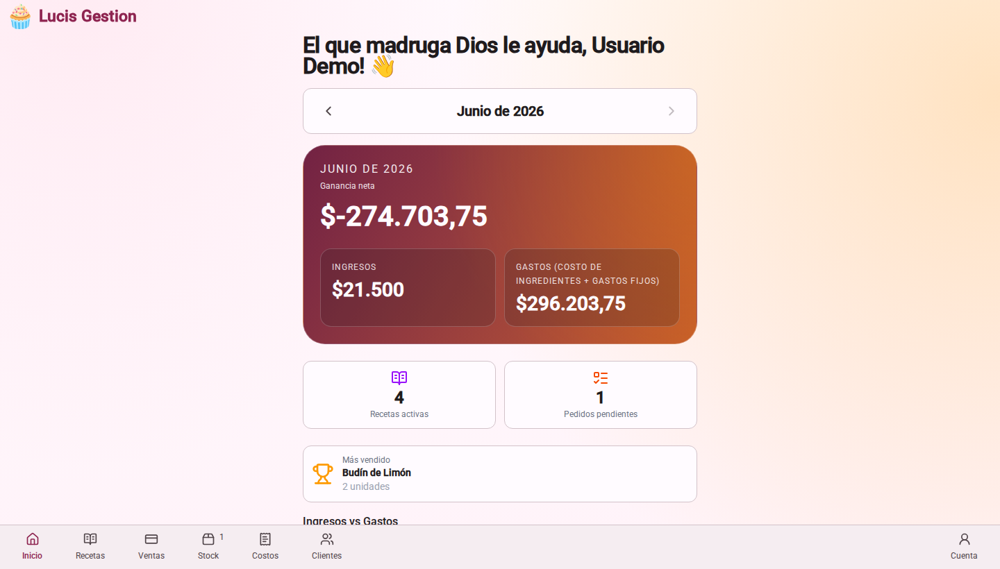
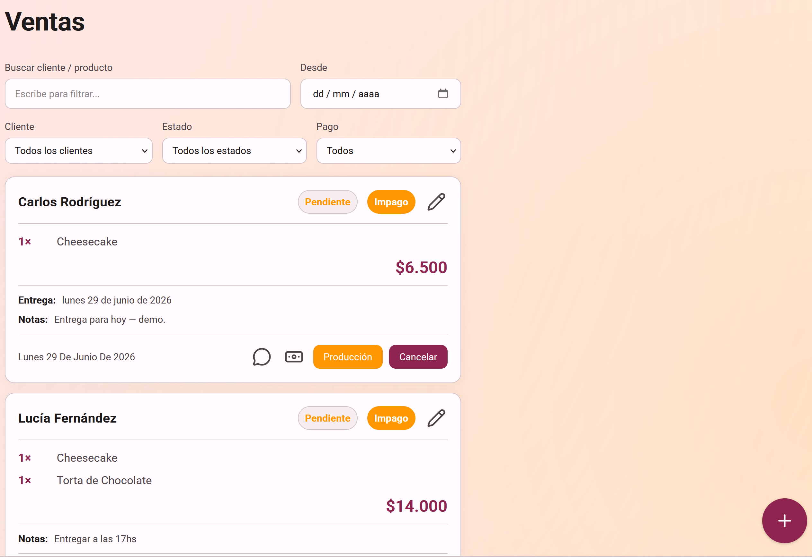
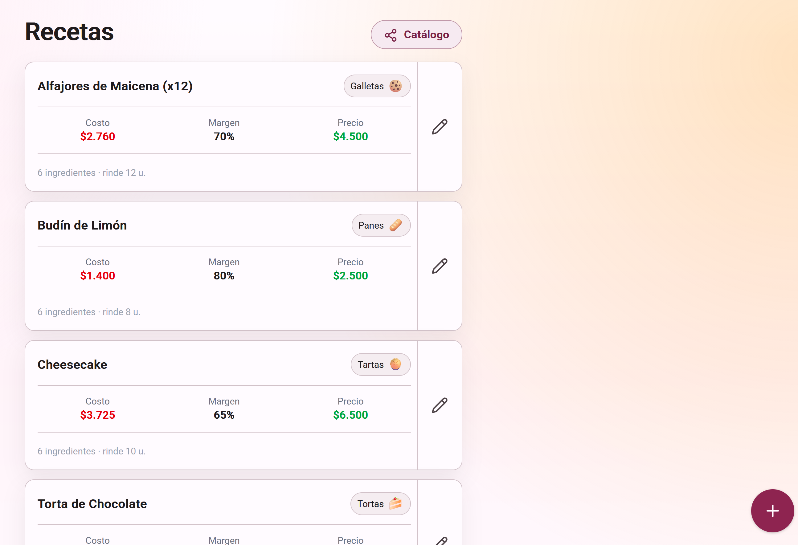
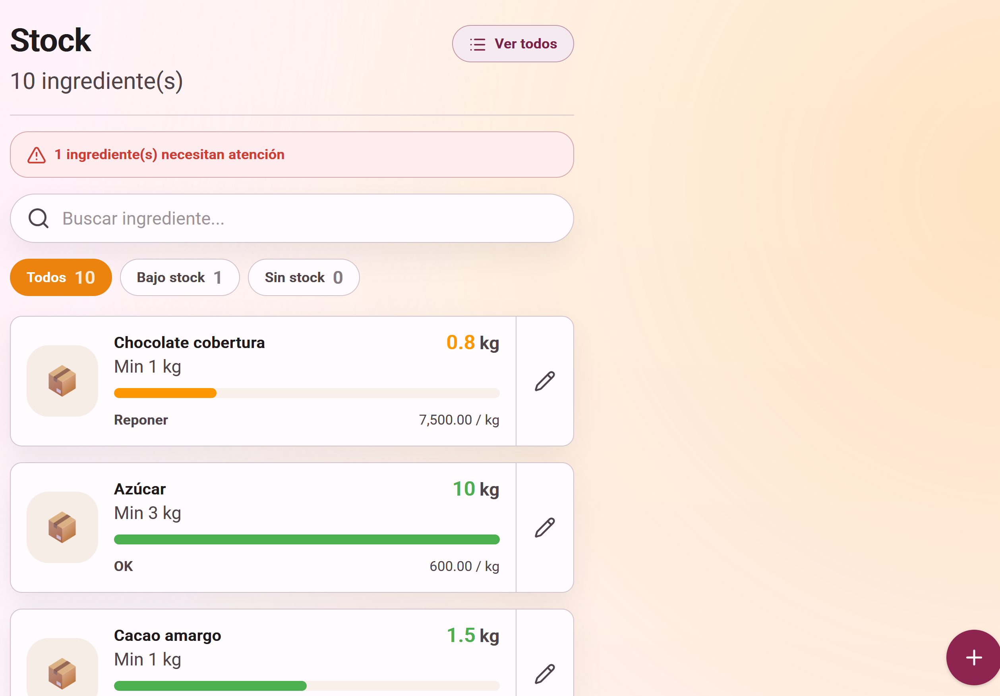

# Lucis Gestión

<div align="center">

**Sistema de gestión para pastelería artesanal con control de costos, stock y ventas**

[](https://angular.dev/)
[](https://firebase.google.com/)
[](https://www.typescriptlang.org/)
[](https://ngrx.io/)
[](#)

[🚀 Live Demo](https://lucis-gestion-6cea2.web.app/) • [🐛 Reportar bug](https://github.com/nkonko/LucisGestion/issues) • [📚 Casos de prueba](read%20first/MANUAL-CASOS-DE-PRUEBA.md)

</div>

---

[](https://github.com/nkonko/LucisGestion/actions/workflows/tests.yml) [](https://github.com/nkonko/LucisGestion/actions/workflows/e2e.yml) [](https://github.com/nkonko/LucisGestion/actions/workflows/firebase-preview.yml) [](https://github.com/nkonko/LucisGestion/actions/workflows/firebase-release.yml)

Lucis Gestión permite administrar ingredientes, recetas con costeo automático, ventas con control de stock, clientes y métricas operativas para un negocio de pastelería artesanal.

## Tabla de contenidos

- [Estado del proyecto](#estado-del-proyecto)
- [Tech Stack](#tech-stack)
- [Requisitos](#requisitos)
- [Inicio rápido](#inicio-rápido)
- [Demo visual](#demo-visual)
- [Variables y configuración Firebase](#variables-y-configuración-firebase)
- [Comandos](#comandos)
- [Testing](#testing)
- [Release](#release)
- [Troubleshooting](#troubleshooting)
- [Estructura del proyecto](#estructura-del-proyecto)
- [Documentación adicional](#documentación-adicional)

## Estado del proyecto

- Estado general: estable para uso diario en modo demo/mock.
- Autenticación y persistencia real: disponibles con Firebase correctamente configurado.
- E2E automatizados: cubren navegación principal, flujo de recetas modal, creación y filtros de ventas.
- Cobertura funcional completa: ver manual de pruebas en [read first/MANUAL-CASOS-DE-PRUEBA.md](read%20first/MANUAL-CASOS-DE-PRUEBA.md).

## Tech Stack

- Angular 22 (standalone components, signals, OnPush)
- UI propia + Tailwind CSS 4
- NgRx Signals (store reactivo)
- Firebase (Auth, Firestore, Hosting)
- PWA (Service Worker, offline support)
- Sentry (error tracking)

## Requisitos

| Herramienta | Versión mínima |
|---|---|
| Node.js | 22.22.3+ |
| pnpm | 11+ |
| Angular CLI | 22+ |
| Firebase CLI | 13+ (solo para deploy) |

## Inicio rápido

### Opción A: Demo local sin Firebase (recomendada para onboarding)

```bash
pnpm install
pnpm start:mock
```

- URL: http://localhost:4200
- Login: automático como owner demo.
- Datos: en memoria (se reinician al refrescar).

### Opción B: Modo real con Firebase

```bash
pnpm install
pnpm start
```

Requiere completar la configuración indicada en la sección Variables y configuración Firebase.

## Demo visual

> Capturas del flujo real de la aplicación.

### Dashboard



### Ventas



### Recetas



### Stock



## Variables y configuración Firebase

Para modo real, completar los valores en src/environments/environment.ts (y opcionalmente en src/environments/environment.prod.ts):

| Clave | Propósito |
|---|---|
| firebase.apiKey | API key de Firebase Web App |
| firebase.authDomain | Dominio de auth del proyecto |
| firebase.projectId | ID del proyecto |
| firebase.storageBucket | Bucket de Storage |
| firebase.messagingSenderId | Sender ID de Firebase |
| firebase.appId | App ID de Firebase |
| allowedEmails | Lista de emails permitidos |
| gemini.apiKey | API key para features con Gemini |
| gemini.model | Modelo de Gemini |
| gemini.baseUrl | Endpoint base de Gemini |
| sentry.dsn | DSN para monitoreo de errores |

Variables de GitHub Environment para release con sourcemaps:

| Clave | Tipo | Uso |
|---|---|---|
| SENTRY_DSN | Variable | Inicialización del SDK y fallback de project id |
| SENTRY_ORG | Variable | Organización de Sentry para sentry-cli |
| SENTRY_PROJECT | Variable | Slug del proyecto de Sentry para upload de sourcemaps |
| SENTRY_AUTH_TOKEN | Secret | Autenticación de sentry-cli en CI |

Guía paso a paso de despliegue y configuración completa en [read first/GUIA-DESPLIEGUE.md](read%20first/GUIA-DESPLIEGUE.md).

## Comandos

| Comando | Descripción |
|---|---|
| pnpm start | Servidor de desarrollo (Firebase real) |
| pnpm start:mock | Servidor con datos de prueba (sin Firebase) |
| pnpm build | Build de producción |
| pnpm build:mock | Build con configuración mock |
| pnpm lint | Lint con angular-eslint |
| pnpm test | Unit tests |
| pnpm test:mock | Tests de flujo mock helper scripts |
| pnpm test:ci | Tests de CI para entorno mock |
| pnpm e2e | Tests E2E con Playwright |
| pnpm coverage:check | Verificación de cobertura |
| pnpm release vX.Y.Z | Proceso de release con tag |

## Testing

### Unit tests

```bash
pnpm test
```

### E2E tests

Con app levantada en localhost:4200:

```bash
pnpm e2e
```

Para correr una spec puntual:

```bash
npx playwright test e2e/recipes-modal-flow.spec.ts --project=chromium
```

Matriz de cobertura funcional y casos manuales: [read first/MANUAL-CASOS-DE-PRUEBA.md](read%20first/MANUAL-CASOS-DE-PRUEBA.md).

## Release

El comando release automatiza versionado, build, tag y push de tag.

```bash
pnpm release v0.1.0
```

Opcional, sin subida de sourcemaps:

```bash
pnpm release v0.1.0 --skip-upload
```
Validaciones incluidas:

- Formato de versión semántica vX.Y.Z.
- Rama actual obligatoria main.
- Commit automático de src/environments/version.ts.
- Build de producción previo al tag.
- Creación y push del tag para disparar pipeline de release.

## Troubleshooting

### Error de login o Firestore en local

- Verificar valores de Firebase en src/environments/environment.ts.
- Confirmar proveedor Google habilitado en Firebase Auth.
- Probar primero pnpm start:mock para aislar problemas de UI.

### E2E fallan al iniciar

- Confirmar app activa en http://localhost:4200.
- Limpiar estado previo del navegador de pruebas.
- Correr una spec aislada para detectar flake más rápido.

### Build falla en CI por configuración

- Revisar variables de entorno y archivos de environment.
- Ejecutar localmente pnpm build y pnpm test:ci antes de subir cambios.

## Estructura del proyecto

```text
src/
  app/
    core/
      guards/
      models/
      services/
      store/
      utils/
    features/
      backup-restore/
      customers/
      dashboard/
      financial-reports/
      fixed-costs/
      ingredients/
      landing/
      login/
      recipes/
      sales/
      stock/
    shared/
      layout/
      pipes/
      ui/
      ui-bottom-sheet/
  environments/
  styles/
```

## Documentación adicional

- [read first/GUIA-DESPLIEGUE.md](read%20first/GUIA-DESPLIEGUE.md) — Guía de despliegue en Firebase
- [read first/MANUAL-CASOS-DE-PRUEBA.md](read%20first/MANUAL-CASOS-DE-PRUEBA.md) — Casos de prueba manuales + cobertura E2E

---

<div align="center">

Crafted with ❤️ by Nicolas Azzara

</div>
